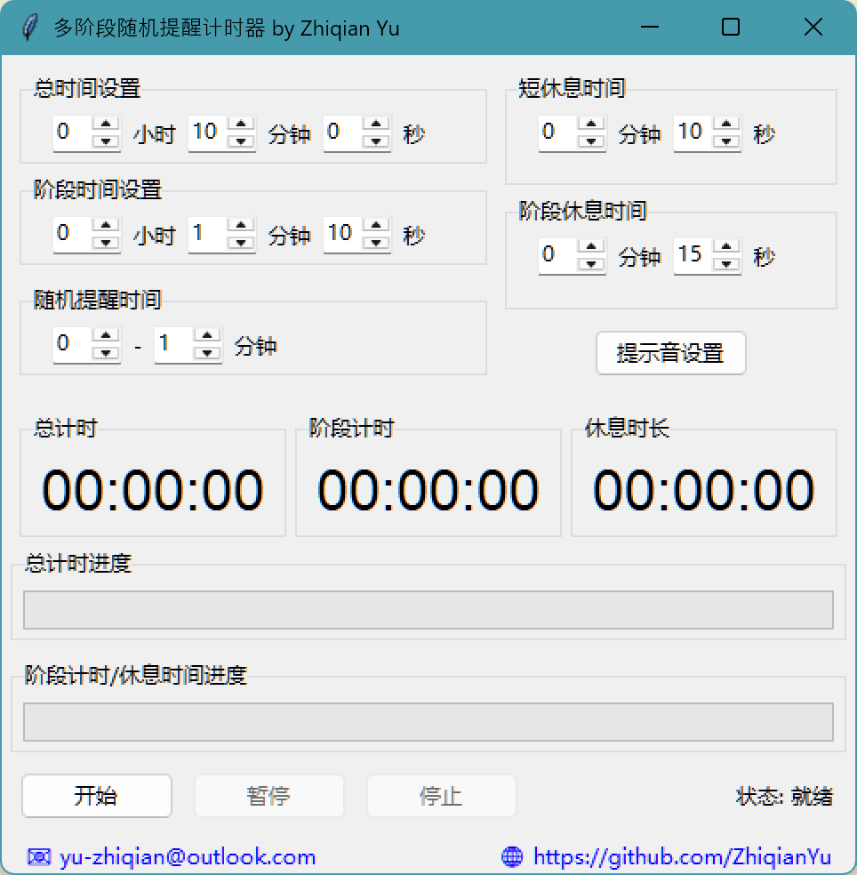
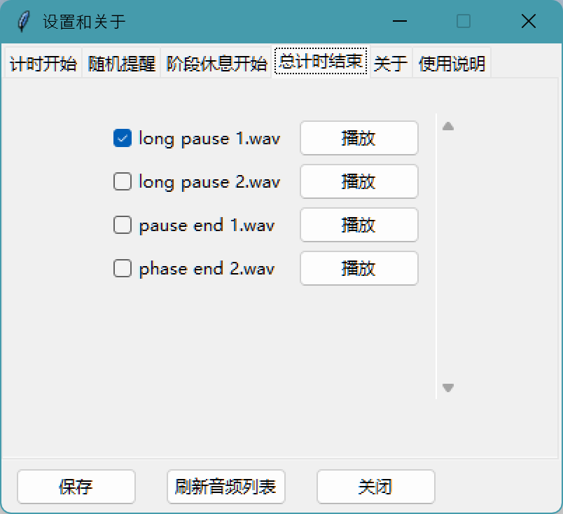

# 🕒 多阶段随机提醒计时器

一个支持 **阶段计时**、**随机提醒短休息**、**阶段间休息** 的高可配置桌面计时工具。适合用在番茄工作法、自主学习、集中注意力训练等场景中。

---

## 📦 功能特性

- 自定义总时间、阶段时间、短休息、阶段休息；
- 随机提醒触发短休息；
- 提示音自定义，支持 `.mp3/.wav` 文件；
- 支持配置保存与加载；
- 打包为 `.exe` 后可离线运行；

---

## 🖥️ 界面截图




---

## 🧪 使用方法

### ✅ 运行方式一：源码运行

1. 安装依赖：
    ```bash
    pip install pygame
    ```
2. 运行程序：
    ```bash
    python Multi Stage Random Notification Timer.py
    ```
3. 放置配置文件 `config.json` 与程序同目录。

---

### ✅ 运行方式二：使用打包好的 `.exe`

> 下载发布页中的 `Multi Stage Random Notification Timer.exe`，并确保放在同目录下的 `config.json` 存在。

## 📄 License

This software is licensed for **personal and non-commercial use only**.

For commercial use (including in companies, products, SaaS platforms), you must obtain a paid license. Please contact:

📧 yu-zhiqian@outlook.com  
🌐 [github.com/ZhiqianYu](https://github.com/ZhiqianYu)

Unauthorized commercial use is **strictly prohibited**.
